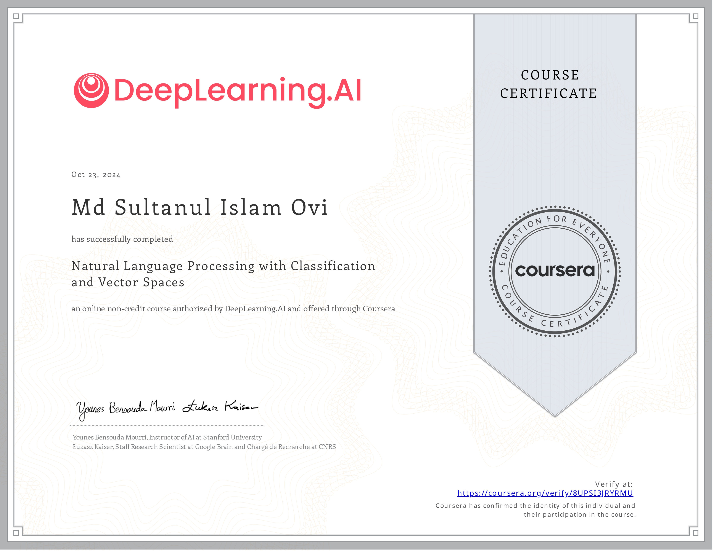
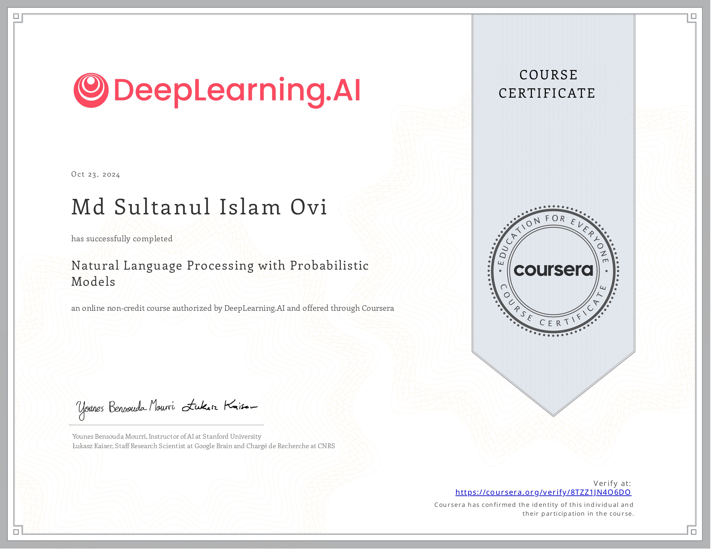
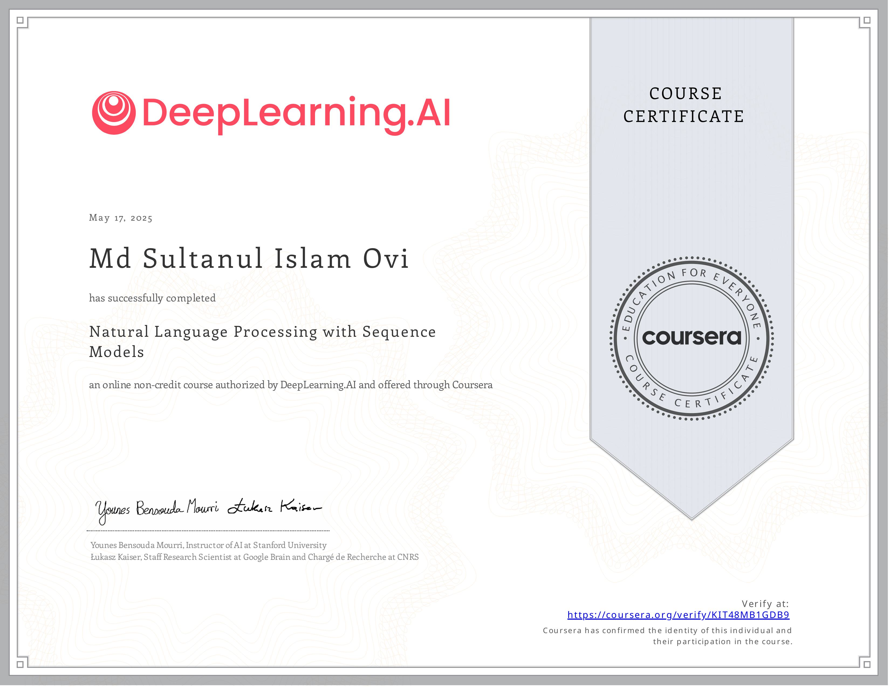

# 📝 Natural Language Processing Specialization

### Coursera | DeepLearning.AI | 4-Course Series on NLP 🚀

This specialization dives deep into **Natural Language Processing (NLP)**—the intersection of linguistics, computer science, and AI—to transform raw text into actionable insights using **state-of-the-art algorithms**.

---

## 🌟 Key Takeaways:

- Master **sentiment analysis** and **question-answering** models.
- Build powerful tools for **language translation**, **text summarization**, and **chatbots**.
- Gain expertise in **machine learning** and **deep learning** techniques for NLP.

---

## 🏗️ Applied Projects Overview

1. **Logistic Regression** & **Naïve Bayes**  
   _Sentiment analysis, analogy completion, language translation, and nearest neighbor search._
2. **Hidden Markov Models** & **Embeddings**  
   _Autocorrect, autocomplete, and part-of-speech (POS) tagging._
3. **RNNs**, **LSTMs**, **GRUs** & **Siamese Networks**  
   _Advanced text generation and duplicate question detection._
4. **Attention Mechanisms**:  
   _Create chatbots, perform question-answering, and explore BERT & Transformer models with 🤗._

---

## 🧑‍🏫 Taught by Industry Experts

- **Younes Bensouda Mourri**  
  _Stanford AI Instructor & Co-creator of the Deep Learning Specialization._
- **Łukasz Kaiser**  
  _Google Brain Researcher, Co-author of Tensorflow, Tensor2Tensor, Trax, and the Transformer._

---

# 📒 Course 1: Natural Language Processing with Classification and Vector Spaces

### 🛠️ What I Worked On:

1. **Sentiment Analysis with Logistic Regression & Naïve Bayes**  
   _Classified tweets to determine positive or negative sentiment using two classic ML techniques._

2. **Vector Space Models & PCA for Word Relationships**  
   _Explored relationships between words using word embeddings and applied **PCA** to reduce dimensionality and visualize them._

3. **English-to-French Translation with Word Embeddings**  
   _Built a simple translation algorithm using pre-computed word embeddings and **locality-sensitive hashing** (LSH) for approximate k-nearest neighbor search._

🚀 This course laid the **foundation for NLP models**, enhancing my understanding of **classification techniques** and **vector space operations**.

---

# 📒 Course 2: Natural Language Processing with Probabilistic Models

### 🛠️ What I Worked On:

1. **Auto-Correct Algorithm with Minimum Edit Distance & Dynamic Programming**  
   _Developed a basic spell checker using **minimum edit distance** techniques combined with **dynamic programming** for optimization._

2. **Part-of-Speech (POS) Tagging with the Viterbi Algorithm**  
   _Implemented **Viterbi Algorithm** to tag words with their parts of speech—an essential task in **computational linguistics**._

3. **Auto-Complete Algorithm Using N-gram Language Model**  
   _Created a smarter **auto-complete** system leveraging an **N-gram language model** to predict the next word in a sequence._

4. **Custom Word2Vec Model with Neural Networks**  
   _Built my own **Word2Vec** implementation using a **continuous bag-of-words (CBOW)** neural network to compute word embeddings._

🚀 This course took me deeper into **probabilistic models**, helping me master **dynamic programming**, **POS tagging**, **language modeling**, and **neural embeddings**.

---

# 📒 Course 3: Natural Language Processing with Sequence Models

### 🛠️ What I Worked On:

1. **Sentiment Analysis of Tweets with GLoVe Word Embeddings**  
   _Trained a neural network using **GLoVe embeddings** to classify the sentiment of tweets as positive or negative._

2. **Shakespeare Text Generation Using a GRU Language Model**  
   _Built a **Gated Recurrent Unit (GRU)**-based language model to generate synthetic Shakespeare-style text._

3. **Named Entity Recognition (NER) with LSTM Networks**  
   _Trained a **recurrent neural network (RNN)** with **LSTMs** and linear layers to recognize named entities in text._

4. **Question Similarity Detection Using Siamese LSTM Models**  
   _Developed a **Siamese LSTM model** to compare pairs of questions and detect those with the same meaning but different wording._

🚀 This course gave me hands-on experience with **sequence models**, **RNNs**, **GRUs**, **LSTMs**, and **Siamese networks**—all crucial for advanced NLP tasks.

---

# 📒 Course 4: Natural Language Processing with Attention Models

### 🛠️ What I Worked On:

1. **English-to-German Translation with Encoder-Decoder Attention Model**  
   _Implemented an **encoder-decoder model with attention** to translate complete sentences from English to German._

2. **Text Summarization Using a Transformer Model**  
   _Built a **Transformer-based model** to generate concise summaries from longer texts._

3. **Question-Answering with T5 and BERT Models**  
   _Utilized **T5** and **BERT** models to accurately perform **question-answering** tasks._

4. **Chatbot Development with a Reformer Model**  
   _Created an interactive **chatbot** using the **Reformer** model for efficient NLP processing._

🚀 This course equipped me with advanced **attention-based architectures**, from **Transformers** to **T5** and **BERT**, solidifying my skills for modern NLP applications.

---
